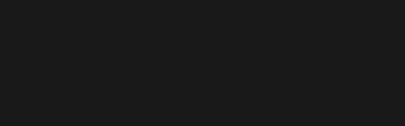
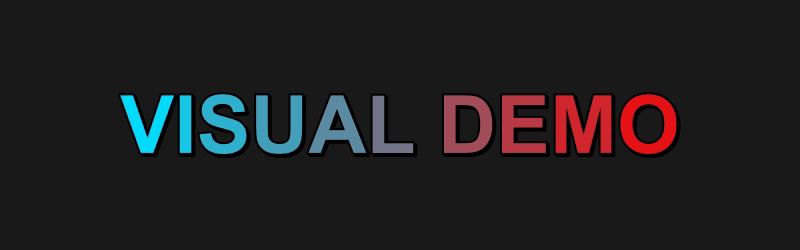
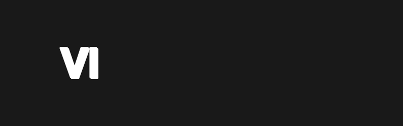
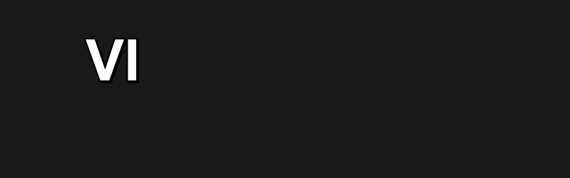
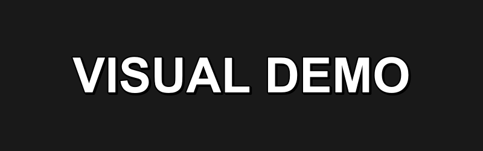
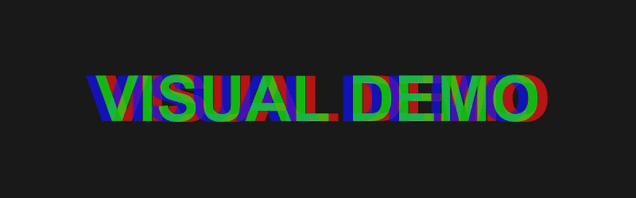

# TypeMotion
**Aegisub reinventado para subtítulos estilizados de YouTube.**

[-lightgrey?style=for-the-badge)](#-licencia)

*Un fork personalizado de Aegisub, enfocado 100% en la creación de subtítulos estilizados para YouTube (YTT/SRV3), con un conjunto de efectos integrados listos para usar desde la primera apertura.*

 

[🇪🇸 **Leer en Español**](#-español) &nbsp; | &nbsp; [🇺🇸 **Read in English**](#-english) &nbsp; | &nbsp; [🇧🇷 **Ler em Português**](#-português)

 

  

---

<h2 id="-español">🇪🇸 Documentación en Español</h2>

### 📖 ¿Qué es TypeMotion?

**TypeMotion** es una versión modificada de Aegisub, construida específicamente para creadores de contenido de YouTube que trabajan con subtítulos estilizados en formato **YTT/SRV3**. En lugar de instalar Aegisub y luego buscar, configurar y actualizar decenas de automatizaciones sueltas, TypeMotion las trae integradas desde el primer inicio, junto con mejoras de interfaz pensadas para este flujo de trabajo específico.

### ✨ Efectos Incluidos

| Efecto | Descripción | Demo Visual |
| :--- | :--- | :---: |
| **Fadeworks** | Fades de entrada/salida, por alpha o color, y animaciones letra por letra. |  |
| **Gradient** | Gradientes horizontales calculados automáticamente letra por letra, con soporte multilinea. |  |
| **Karaoke con Flash** | Sincroniza destellos de color y transparencia con el ritmo del karaoke. |  |
| **Karaoke con Movimiento** | Añade desplazamiento y dinamismo a las sílabas según su tiempo de karaoke. |  |
| **Karaoke Fluido** | Transiciones suaves y continuas entre sílabas, sin cortes bruscos. |  |
| **Karaoke Reverso** | Sistema de desaparición progresiva basado en los tiempos originales de karaoke (`\k`). |  |
| **Glitch** | Aberración cromática orgánica con desplazamiento de ejes, simulando fallos digitales. |  |

### 🙏 Créditos y Base del Proyecto

TypeMotion no parte de cero. Este proyecto existe gracias al trabajo de:

* **[Aegisub](https://github.com/Aegisub/Aegisub)** — El editor de subtítulos original en el que se basa todo este proyecto.
* **[arch1t3cht/Aegisub (fork)](https://github.com/arch1t3cht/Aegisub)** — De este fork se tomaron dos piezas fundamentales para TypeMotion:
  * El **modo oscuro experimental**, adaptado e integrado en la interfaz de forma híbrida.
  * El sistema de **Folders**, usado en TypeMotion para organizar y estructurar los efectos incluidos.

Todo el reconocimiento a sus respectivos autores y colaboradores por sentar las bases sobre las que se construyó TypeMotion.

### ⚙️ Instalación

1. Ve a la página de [**Releases**](https://github.com/SonizBeibe/TypeMotion/releases/tag/PreBuild-1.0.2) y descarga la última versión.
2. Extrae el contenido en la carpeta de tu preferencia.
3. Ejecuta `TypeMotion.exe` (o el ejecutable correspondiente).
4. Los efectos ya vienen integrados en el menú `Tools`, listos para usar sin configuración adicional.

### ⚖️ Licencia

Este proyecto hereda la licencia de **Aegisub**. Consulta el archivo `LICENSE` de este repositorio para más detalles.

### 💬 Comunidad

---

<h2 id="-english">🇺🇸 English Documentation</h2>

### 📖 What is TypeMotion?

**TypeMotion** is a modified version of Aegisub, built specifically for YouTube content creators working with styled **YTT/SRV3** subtitles. Instead of installing Aegisub and then hunting down, configuring, and updating dozens of separate automation scripts, TypeMotion ships with them built in from the first launch, alongside interface improvements tailored to this specific workflow.

### ✨ Included Effects

| Effect | Description | Visual Demo |
| :--- | :--- | :---: |
| **Fadeworks** | Fade in/out, alpha or color fades, and letter-by-letter animations. |  |
| **Gradient** | Horizontal gradients automatically calculated letter-by-letter, with multi-line support. |  |
| **Flash Karaoke** | Syncs color and transparency flashes to the karaoke rhythm. |  |
| **Motion Karaoke** | Adds movement and dynamism to syllables based on their karaoke timing. |  |
| **Fluid Karaoke** | Smooth, continuous transitions between syllables, no abrupt cuts. |  |
| **Reverse Karaoke** | Progressive disappearance system based on original karaoke timings (`\k`). |  |
| **Glitch** | Organic chromatic aberration with axis displacement, simulating digital failures. |  |

### 🙏 Credits & Project Foundation

TypeMotion doesn't start from scratch. This project exists thanks to the work of:

* **[Aegisub](https://github.com/Aegisub/Aegisub)** — The original subtitle editor this whole project is based on.
* **[arch1t3cht/Aegisub (fork)](https://github.com/arch1t3cht/Aegisub)** — Two key pieces of TypeMotion were taken from this fork:
  * The **experimental dark mode**, adapted and integrated into the interface in a hybrid form.
  * The **Folders** system, used in TypeMotion to organize and structure the included effects.

Full credit goes to their respective authors and contributors for laying the groundwork TypeMotion was built on.

### ⚙️ Installation

1. Go to the [**Releases**](https://github.com/SonizBeibe/TypeMotion/releases/tag/PreBuild-1.0.2) page and download the latest version.
2. Extract the contents to a folder of your choice.
3. Run `TypeMotion.exe` (or the corresponding executable).
4. The effects are already integrated into the `Toolsn` menu, ready to use with no extra setup.

### ⚖️ License

This project inherits its license from **Aegisub**. See the `LICENSE` file in this repository for details.

### 💬 Community

---

<h2 id="-português">🇧🇷 Documentação em Português</h2>

### 📖 O que é o TypeMotion?

O **TypeMotion** é uma versão modificada do Aegisub, construída especificamente para criadores de conteúdo do YouTube que trabalham com legendas estilizadas no formato **YTT/SRV3**. Em vez de instalar o Aegisub e depois procurar, configurar e atualizar dezenas de automações separadas, o TypeMotion já as traz integradas desde a primeira execução, junto com melhorias de interface pensadas para esse fluxo de trabalho específico.

### ✨ Efeitos Inclusos

| Efeito | Descrição | Demonstração Visual |
| :--- | :--- | :---: |
| **Fadeworks** | Fades de entrada/saída, por alpha ou cor, e animações letra por letra. |  |
| **Gradient** | Gradientes horizontais calculados automaticamente letra por letra, com suporte a múltiplas linhas. |  |
| **Karaokê com Flash** | Sincroniza flashes de cor e transparência com o ritmo do karaokê. |  |
| **Karaokê com Movimento** | Adiciona deslocamento e dinamismo às sílabas conforme seu tempo de karaokê. |  |
| **Karaokê Fluido** | Transições suaves e contínuas entre sílabas, sem cortes bruscos. |  |
| **Karaokê Reverso** | Sistema de desaparecimento progressivo baseado nas marcações originais de karaokê (`\k`). |  |
| **Glitch** | Aberração cromática orgânica com deslocamento de eixos, simulando falhas digitais. |  |

### 🙏 Créditos e Base do Projeto

O TypeMotion não parte do zero. Este projeto existe graças ao trabalho de:

* **[Aegisub](https://github.com/Aegisub/Aegisub)** — O editor de legendas original no qual todo este projeto se baseia.
* **[arch1t3cht/Aegisub (fork)](https://github.com/arch1t3cht/Aegisub)** — Deste fork foram utilizadas duas peças fundamentais para o TypeMotion:
  * O **modo escuro experimental**, adaptado e integrado à interface de forma híbrida.
  * O sistema de **Folders**, usado no TypeMotion para organizar e estruturar os efeitos inclusos.

Todo o reconhecimento vai para seus respectivos autores e colaboradores por estabelecerem as bases sobre as quais o TypeMotion foi construído.

### ⚙️ Instalação

1. Acesse a página de [**Releases**](https://github.com/SonizBeibe/TypeMotion/releases/tag/PreBuild-1.0.2) e baixe a versão mais recente.
2. Extraia o conteúdo em uma pasta de sua preferência.
3. Execute o `TypeMotion.exe` (ou o executável correspondente).
4. Os efeitos já vêm integrados no menu `Tools`, prontos para usar sem configuração adicional.

### ⚖️ Licença

Este projeto herda a licença do **Aegisub**. Consulte o arquivo `LICENSE` deste repositório para mais detalhes.

### 💬 Comunidade

---

  
Made with ❤️ by <strong><a href="https://github.com/SonizBeibe">Soniz</a></strong>

